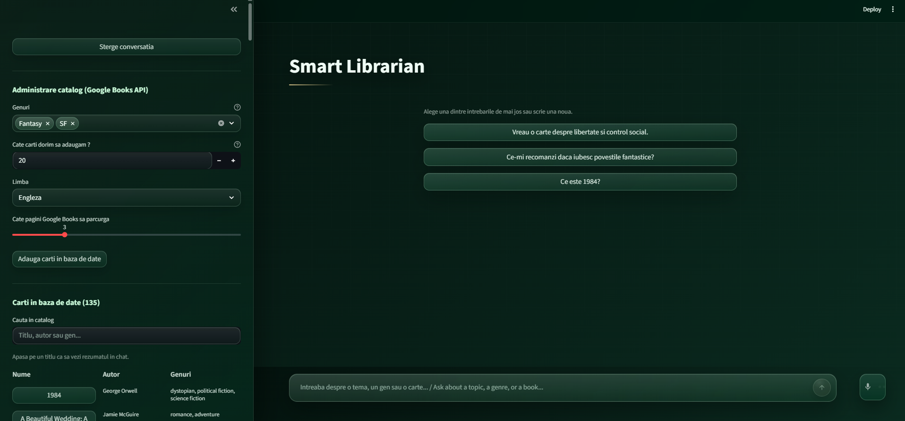
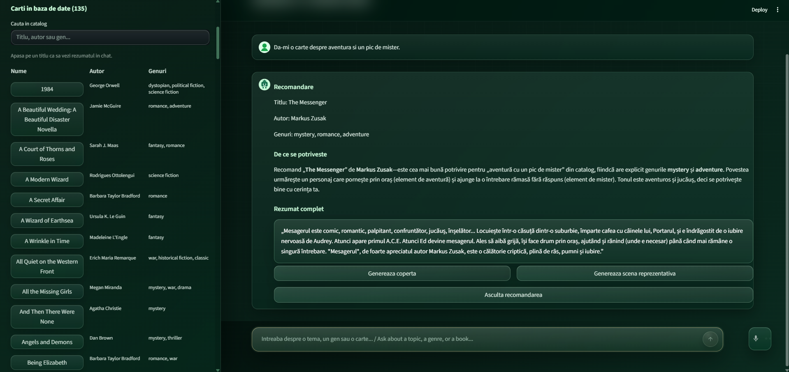
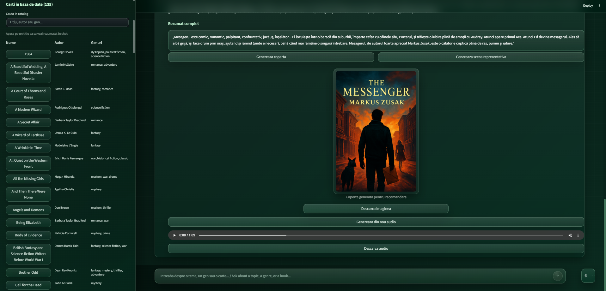

# Smart Librarian - Public Overview

Public technical overview of **Smart Librarian**, an AI-powered book recommendation web application that combines RAG, semantic search, OpenAI tool calling, a local book catalog, voice input, audio narration, image generation, and a Streamlit interface.

<p align="center">
  
</p>

> The full source code is private due to intellectual property considerations. This repository documents the project’s functionality, architecture, technologies, screenshots, and implementation approach without exposing private source code, secrets, generated assets, or internal Git history.

---

## Short Description

Smart Librarian is a web application that helps users discover book recommendations based on a theme, genre, mood, or natural-language question.

It works like an AI librarian: the user writes or dictates what they are looking for, the application searches semantically through a local book catalog, recommends a suitable book, and displays the full summary from the local database instead of inventing content.

The application can also be used to browse the catalog, search books by title, author, or genre, import new books from Google Books, generate audio narration for a recommendation, and create representative images such as a book cover or a scene inspired by the selected book.

---

## Application Screenshots

### Catalog Import & Empty Main Page

The sidebar provides catalog import controls and catalog browsing, while the main page starts with an empty conversation state and starter-style interaction flow.



### Simple Prompt

The user can ask for a recommendation using natural language. The system retrieves relevant candidates, chooses a suitable book, and renders a structured response.



### Generated Audio Transcript & Generated Cover

For a selected recommendation, the app can generate audio narration and representative visuals, such as a book-cover concept or a scene inspired by the recommended book.



---

## Core Functional Idea

Smart Librarian is not a free-form chatbot that answers only from model memory. It is built around a controlled RAG pipeline.

The core idea is:

```text
Retrieve first
   ↓
Reason over retrieved candidates
   ↓
Call the local summary tool
   ↓
Render a grounded answer in the UI
```

This design makes the final answer more reliable because the long summary is pulled from the local catalog, not invented by the model.

---

## Main Features

### AI Book Recommendations

The user can ask for a book using natural language, for example:

- “I want a book about freedom and social control.”
- “What do you recommend if I love fantasy stories?”
- “Give me a mystery book.”
- “Vreau o carte despre libertate si control social.”
- “Ce-mi recomanzi daca iubesc povestile fantastice?”

The application performs semantic matching based on the user’s intent, themes, genres, tone, and context.

### Semantic Search with ChromaDB

The local catalog is indexed in ChromaDB using OpenAI embeddings. Instead of relying on simple keyword matching, the application searches by meaning and retrieves the closest book candidates.

### Local Summary Tool

The model must call a local tool named `get_summary_by_title(title)` to fetch the exact full summary from the local JSON catalog.

This is one of the most important design decisions in the project: the recommendation can be AI-assisted, but the final long summary is grounded in a controlled local source.

### Streamlit Web Interface

The application is exposed through a Streamlit interface with:

- main chat area;
- recommendation cards;
- catalog import controls;
- catalog browsing;
- search by title, author, or genre;
- direct summary loading;
- audio controls;
- image generation controls;
- custom dark green visual theme.

### Catalog Browsing and Search

The sidebar includes a local catalog browser where users can:

- search by title;
- search by author;
- search by genre;
- click a book and open its exact full summary directly in the chat.

This separates two user intentions:

1. asking the chatbot to recommend a book;
2. opening a known book directly from the catalog.

### Google Books Import

The catalog can be extended through an optional Google Books import flow.

The import process can:

- fetch book candidates from Google Books;
- normalize raw metadata;
- infer genres, themes, tone, and audience;
- build short and full summaries;
- merge new entries into the local catalog;
- refresh the local tool cache;
- rebuild the ChromaDB vector store.

### Bilingual Interaction

The app supports Romanian and English.

It can detect the input language and adapt the response payload so the user experience remains consistent in both languages.

### Voice Input

The user can provide an audio question. The app transcribes the speech and sends the resulting text through the same recommendation pipeline.

### Audio Narration

The final recommendation and full summary can be converted into playable and downloadable narration using text-to-speech.

### Image Generation

For a recommendation, the user can generate:

- a representative book-cover concept;
- a representative scene inspired by the selected book.

### Safety and Filtering

The system includes local and remote safety layers:

- input cleaning and normalization;
- local blocked-term filtering in Romanian and English;
- scope detection for book-related questions;
- OpenAI moderation on input;
- optional OpenAI moderation on output;
- title and query alias normalization;
- tool enforcement for retrieved catalog candidates;
- image prompt sanitization and safe-mode retry behavior;
- voice transcription restricted to Romanian and English.

---

## Technology Stack

| Area | Technologies |
|---|---|
| Language | Python |
| Web UI | Streamlit |
| AI / LLM | OpenAI API |
| RAG | OpenAI embeddings + ChromaDB |
| Vector store | ChromaDB |
| Tool calling | OpenAI tool-calling workflow with local summary lookup |
| Data validation | Pydantic |
| Local catalog | JSON, `data/book_summaries.json` |
| Settings persistence | SQLite |
| External data import | Google Books API |
| Environment config | python-dotenv |
| HTTP requests | requests |
| Language detection | langdetect |
| Speech-to-text | OpenAI transcription |
| Text-to-speech | OpenAI TTS |
| Image generation | OpenAI image generation |
| Testing | pytest |
| UI styling | Custom Streamlit CSS |

---

## Architecture Overview

The application is organized around five main layers:

```text
1. Streamlit UI
   Chat input, sidebar controls, catalog browser, audio controls, image controls

2. Safety & Control
   Guardrails, language detection, scope checking, moderation

3. Retrieval Layer
   OpenAI embeddings, ChromaDB semantic search, candidate retrieval

4. LLM & Tool Calling
   The model chooses from retrieved candidates and calls get_summary_by_title(title)

5. Local Sources & Response Builder
   JSON catalog, exact summary retrieval, final response rendering
```

---

## End-to-End Runtime Flow

When a user asks a normal question in the Streamlit app, the flow is:

```text
User question
   ↓
Streamlit UI
   ↓
Input normalization and local guardrails
   ↓
Language detection
   ↓
Scope check for book-related requests
   ↓
OpenAI moderation on input
   ↓
Query embedding
   ↓
ChromaDB semantic search
   ↓
Retrieved book candidates
   ↓
Grounded prompt construction
   ↓
OpenAI model chooses the best title
   ↓
Local tool call: get_summary_by_title(title)
   ↓
Exact full summary from local JSON catalog
   ↓
Final response builder
   ↓
Optional output moderation
   ↓
Recommendation card rendered in Streamlit
```

---

## Catalog Import Flow

The catalog update flow works separately from the normal recommendation flow.

```text
Google Books API
   ↓
Fetch candidate books
   ↓
Normalize metadata
   ↓
Infer genres, themes, tone, and audience
   ↓
Build short and full summaries
   ↓
Update data/book_summaries.json
   ↓
Refresh tool cache
   ↓
Rebuild ChromaDB
   ↓
Catalog ready for runtime
```

Important implementation detail: the normal chat flow does not call the import script for every question. Importing books is handled through a dedicated sidebar administration flow.

---

## Data Model

The internal catalog schema is represented by a `BookSummary` model.

Each book entry contains:

- `id`;
- `title`;
- `author`;
- `genres`;
- `themes`;
- `tone`;
- `audience`;
- `language`;
- `short_summary`;
- `full_summary`;
- `content_for_embedding`.

---

## Main Application Modules

| Module | Responsibility |
|---|---|
| `app_streamlit.py` | Main Streamlit web application |
| `src/config.py` | Environment variables and shared settings |
| `src/logger.py` | Local logging configuration |
| `src/data_loader.py` | Local catalog loading and validation |
| `src/embeddings.py` | Embedding generation and OpenAI client access |
| `src/vector_store.py` | Chroma collection creation and rebuilding |
| `src/retriever.py` | Semantic search over the local catalog |
| `src/prompts.py` | Grounded prompts and system instructions |
| `src/tools.py` | Exact-title summary lookup tool |
| `src/guardrails.py` | Local validation, filtering, and scope detection |
| `src/language_support.py` | Language detection and translation helpers |
| `src/chatbot.py` | Main orchestration layer |
| `src/audio_narration.py` | Text-to-speech narration helpers |
| `src/speech_transcription.py` | Speech-to-text helpers |
| `src/book_image_generation.py` | Image prompt building and generation |
| `src/catalog_settings_repository.py` | SQLite persistence for import settings |
| `src/catalog_ingestion_service.py` | Catalog import orchestration |
| `scripts/database_loader_script.py` | Manual Google Books import and normalization script |
| `scripts/rebuild_index.py` | Manual vector-store rebuild helper |

---

## Local Data and Assets

| Path | Purpose |
|---|---|
| `data/book_summaries.json` | Main local catalog and source of truth |
| `data/blocked_terms_ro.txt` | Romanian blocked terms |
| `data/blocked_terms_en.txt` | English blocked terms |
| `data/app_state.db` | Persisted import settings |
| `assets/avatar_user_green.svg` | User avatar in chat |
| `assets/avatar_robot_blue.svg` | Assistant avatar in chat |
| `logs/app.log` | Local application log |

---

## AI Models and External Services

The private implementation is designed around configurable model names and external services, including:

- chat model for recommendation reasoning;
- embedding model for semantic retrieval;
- speech-to-text model for voice input;
- text-to-speech model for narration;
- moderation model for safety checks;
- image generation model for cover and scene visuals;
- optional Google Books API key for more robust catalog ingestion.

Runtime secrets such as API keys are not exposed in this public overview.

---

## Testing Coverage

The project includes tests for:

- guardrails and scope detection;
- moderation behavior;
- retrieval and tool-calling orchestration;
- summary tool cache reload behavior;
- data loading and title normalization;
- import settings persistence;
- catalog ingestion refresh behavior;
- audio generation helpers;
- image generation helpers;
- speech transcription helpers;
- language normalization logic.

---

## Example Questions

The application can handle prompts such as:

```text
Vreau o carte despre libertate si control social.
Ce-mi recomanzi daca iubesc povestile fantastice?
Ce este 1984?
I want a book about friendship and magic.
Give me a dystopian novel.
Recommend something for children.
```

---

## Limitations

- Recommendation quality depends on the quality and coverage of the local catalog.
- Google Books metadata can be inconsistent, so inferred themes, tone, and audience are heuristic.
- Imported descriptions may require cleanup and normalization.
- Voice interaction is intentionally limited to Romanian and English.
- Image generation can fail for safety reasons, depending on the book context.
- During normal chat usage, the app focuses on the local catalog instead of searching the live internet for books.

---

## Future Improvements

Potential improvements include:

- expanding the local catalog with more curated books;
- improving metadata normalization from Google Books;
- adding more precise recommendation explanations;
- improving multilingual behavior;
- adding more advanced catalog filters;
- improving generated cover and scene prompts;
- adding richer evaluation for recommendation quality;
- extending test coverage around edge cases and safety behavior.

---

## Source Code Availability

The full source code is private due to intellectual property considerations.

A technical walkthrough, sanitized demo, or selected implementation details can be provided upon request.

